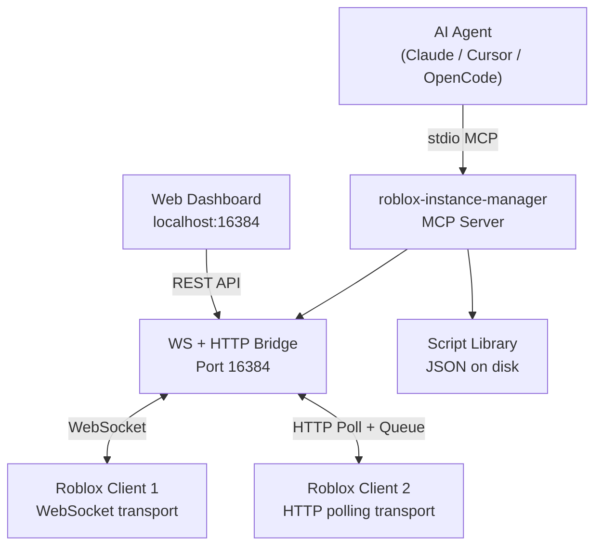

<div align="center">

# ROBLOX AI

**A state-of-the-art MCP server for Roblox vulnerability research, automation, and AI-assisted in-game operations.**

[](https://www.typescriptlang.org/)
[](https://nodejs.org/)
[](LICENSE)
[](https://modelcontextprotocol.io/)
[](https://www.microsoft.com/windows)

</div>

---

## What is this?

ROBLOX AI is a full-stack **Model Context Protocol (MCP) server** that gives your AI agent direct access to running Roblox game clients. It provides a real-time WebSocket bridge, a script library, and a suite of 30+ tools for in-game operations — all surfaced through a sleek local web dashboard.

> **Companion project:** This server pairs with [**notpoiu/roblox-executor-mcp**](https://github.com/notpoiu/roblox-executor-mcp) — the authoritative Roblox executor MCP implementation. Run both together for the full toolkit: this project handles the bridge, script library, and dashboard; notpoiu's handles advanced executor features.

```
AI Agent (Claude / Cursor / OpenCode)
        │  stdio MCP
        ▼
  roblox-instance-manager ──► HTTP Dashboard  http://localhost:16384/
        │
        │  WebSocket Bridge
        ├──────────────────► Roblox Client 1  (account: alt1)
        ├──────────────────► Roblox Client 2  (account: main)
        └──────────────────► Roblox Client N  ...
```

---

## What's New

> Latest round of major improvements:

- **Modern Dashboard** — Full UI redesign. Clean dark theme, SVG icons, responsive layout, real-time activity log backed by actual server logs, script library page.
- **Script Library** — AI-generated scripts are saved as pending and require your approval in the dashboard before being committed.
- **HTTP Command Queue** — The polling bridge now queues multiple concurrent commands instead of overwriting them. Multiple MCP tools can run in parallel against an HTTP-transport client without dropping requests.
- **Multi-Instance Launching** — Bypasses Fishstrap/Bloxstrap entirely. Launches `RobloxPlayerBeta.exe` directly and releases Roblox's singleton mutex after startup so additional instances can be spawned.
- **Better Auth Tickets** — Proper CSRF token flow via `/v2/logout`, `Origin` header, cookie normalization (strips browser warning prefixes), and pre-flight cookie validation with a clear error if a cookie is expired.
- **Token Efficiency** — All tool outputs now support `maxOutputChars` (default 6000, max 32000). Truncation uses a head+tail strategy so the model never loses context at the end of long outputs. Each result is stamped with the source client to prevent cross-client context poisoning.
- **Improved Semantic Search** — Replaced naive line-windowing with AST-aware function-level chunking. Feature extraction adds topics, services, remote names, API calls, and variable roles to each chunk. Search upgraded to **hybrid BM25 + dense vector with Reciprocal Rank Fusion (RRF)** — research shows +20–35% recall improvement.
- **`script-grep` replaces `search-script-sources`** — The old `search-script-sources` pattern required the model to fetch raw script lists and scan them manually (multiple tool calls, high cost). `script-grep` runs server-side regex/literal search across all decompiled scripts in a single call, using JavaScript RegExp syntax — the exact patterns LLMs are trained to produce. Fewer tool calls = lower cost.
- **roblox-executor-mcp integration** — Now pairs directly with [notpoiu/roblox-executor-mcp](https://github.com/notpoiu/roblox-executor-mcp) as the recommended companion executor MCP.

---

## Architecture



### Bridge Relay
Port `16384` runs a self-healing leader-election bridge:
- **Primary mode** — HTTP + WebSocket server, handles client registry and command dispatch.
- **Secondary mode** — Connects to the primary relay. If primary goes down, a secondary promotes itself via jittered election.

---

## Repository Layout

```
ROBLOX-AI/
├── roblox-instance-manager/     # Core TypeScript MCP server & dashboard
│   ├── src/
│   │   ├── tools/               # MCP tools (process lifecycle, script library)
│   │   ├── executor-tools/      # In-game operation tools (require live client)
│   │   ├── scripts/             # Script library store
│   │   ├── semantic/            # Embedding-based script search
│   │   ├── http/                # Dashboard, REST API, WebSocket bridge
│   │   ├── process/             # Roblox launcher & process manager
│   │   └── accounts/            # Encrypted account store
│   └── connector.luau           # In-game injection script
├── chrome-extension/            # Chrome extension for cookie syncing
└── docs/                        # Design specs & research
```

---

## Setup

### Prerequisites
- **Windows** (launcher uses Windows APIs)
- **Node.js 18+**
- **A Roblox executor** that supports `loadstring` and `request`

### Install & Build

```bash
git clone https://github.com/Zaymadkid/ROBLOX-AI.git
cd ROBLOX-AI/roblox-instance-manager

npm install
npm run build
npm start
```

Dashboard opens at **http://localhost:16384/**

### Chrome Extension (Optional)

1. Open `chrome://extensions/`
2. Enable **Developer mode**
3. Click **Load unpacked** → select the `chrome-extension/` folder

---

## AI Client Integration

### Claude Code
```bash
claude mcp add roblox-instance-manager node "/absolute/path/to/ROBLOX-AI/roblox-instance-manager/dist/index.js"
```

### OpenCode / Cursor / Windsurf (`opencode.jsonc` or similar)
```json
{
  "mcpServers": {
    "roblox-instance-manager": {
      "command": "node",
      "args": ["/absolute/path/to/ROBLOX-AI/roblox-instance-manager/dist/index.js"]
    }
  }
}
```

---

## Connecting a Roblox Client

Paste this into your executor inside any Roblox game, or drop [`loader.luau`](loader.luau) into your executor's auto-execute folder:

```lua
local url = "https://raw.githubusercontent.com/Zaymadkid/ROBLOX-AI/main/roblox-instance-manager/connector.luau"
local success, err = pcall(function()
    loadstring(game:HttpGet(url))()
end)

if success then
    print("[MCP] Harness loaded and connected successfully!")
else
    warn("[MCP] Failed to load harness:", tostring(err))
end
```

The client registers itself with the bridge and appears in the dashboard instantly.

---

## Tools Reference

### Process Lifecycle Tools

| Tool | Description |
|------|-------------|
| `launch_client` | Launches Roblox directly via `RobloxPlayerBeta.exe`, bypassing any bootstrapper. Releases the singleton mutex after startup to allow multiple concurrent instances. |
| `join_game` | Teleports a running client into a specific place ID. |
| `list_clients` | Lists all active managed clients with status and uptime. |
| `get_client_status` | Health-checks a specific client (process alive, uptime, place). |
| `restart_client` | Kills and relaunches a client with a fresh auth ticket. |
| `close_client` | Gracefully terminates a client. |
| `manage_accounts` | Add, list, or remove stored accounts. Cookies are encrypted at rest with AES-256-GCM. |
| `take_screenshot` | Captures a full-screen screenshot via PowerShell. |
| `get_executor_info` | Checks executor bridge connectivity and lists available tools. |
| `save_script_to_library` | Saves a Luau script to the library as **pending** for user review. AI always asks before calling this. |

### In-Game Operation Tools

| Tool | Description |
|------|-------------|
| `execute` | Fire-and-forget Luau execution in the active client. |
| `get_data_by_code` | Execute Luau and return serialized values. |
| `execute_file` | Execute a local `.lua`/`.luau` file inside the client. |
| `get_script_content` | Decompile a script by path or proxy reference. Supports `startLine`/`endLine`/`maxLines`. |
| `script_grep` | Regex or literal search across all decompiled scripts (BM25 tokenized). |
| `semantic_search_scripts` | Find scripts by behavior description using hybrid dense + lexical search with RRF. Supports `requireFullIndex` and `indexOnly` modes. |
| `search_instances` | CSS-selector query against the game hierarchy (class, name, tag, property, attribute). |
| `get_descendants_tree` | Depth-limited object tree from a root instance. |
| `get_game_info` | Place ID, universe ID, server metadata. |
| `get_console_output` | Read developer console logs. Supports `filter`, `limit`, `logsOrder`. |
| `ensure_remote_spy` | Load Cobalt remote spy into the client. |
| `get_remote_spy_logs` | List captured remote/bindable calls with direction filter. |
| `block_remote` | Block specific remotes by name and direction. |
| `ignore_remote` | Stop logging a specific remote without blocking it. |
| `clear_remote_spy_logs` | Wipe the remote spy log buffer. |
| `click_button` | Fire click signals on a `TextButton` or `ImageButton` by path. |
| `type_text_box` | Type text into a `TextBox` via key simulation or direct set. |
| `list_roblox_windows` | List active Roblox processes with window titles. |
| `screenshot_window` | Capture a specific Roblox window by PID. |

---

## Dashboard

The web dashboard at `http://localhost:16384/` provides:

- **Dashboard** — Live stats: connected clients, stored accounts, executor status, server uptime
- **Clients** — Full client table with restart/close actions and detail modal
- **Accounts** — Stored profile management with avatar thumbnails and launch buttons
- **Activity Log** — Real-time server event stream with color-coded log levels and clear button
- **Executor** — Bridge status and API capability listing
- **System Info** — Server configuration and connection details
- **Script Library** — Browse AI-saved and manually-added scripts. Pending scripts show an approval prompt

---

## Security

| Concern | How it's handled |
|---------|-----------------|
| Cookie storage | AES-256-GCM encryption with a machine-derived key. Cookies never appear in logs or API responses. |
| Network exposure | Bridge binds to `127.0.0.1` only. Not accessible over LAN by default. |
| AI trust boundary | Only use with AI clients you control. Port `16384` has no authentication. |
| Script safety | AI-generated scripts are saved as `pending` and require explicit user approval before being committed to the library. |

---

## License

MIT — see [LICENSE](LICENSE)
