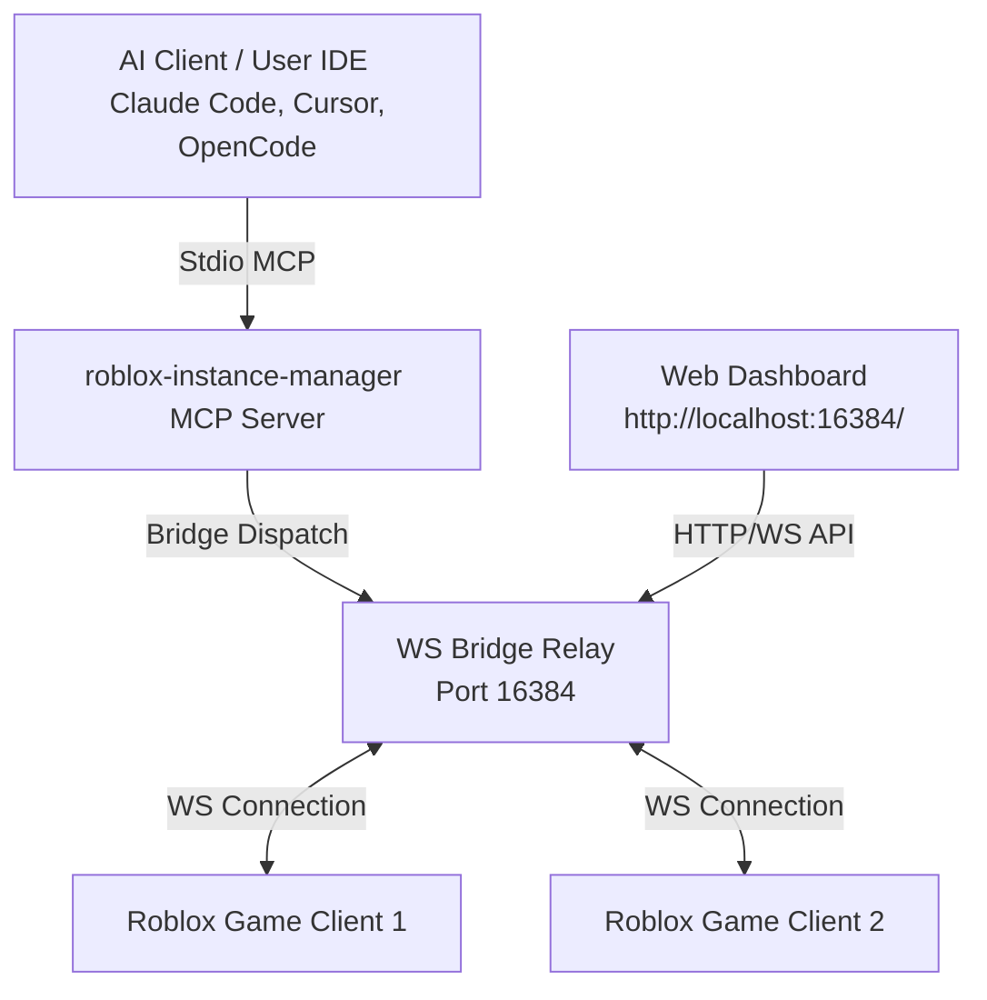

# 🕹️ ROBLOX AI: Vulnerability Research & Automation Toolset

A state-of-the-art, standalone engineering toolset built for **Roblox game vulnerability research**, anti-cheat analysis, and AI-assisted automation. This repository provides a unified MCP (Model Context Protocol) server handling the full process lifecycle and real-time interactive in-game operations.

---

## 💎 Core Capabilities

* 🚀 **Process Control:** Multi-profile launching, automatic cookie authentication, place-joining, and health monitoring.
* 💻 **In-Game Operations:** Direct Luau execution, script decompilation, Remote Event/Function spying.
* 🔍 **Analysis & Search:** Regex script grep, semantic script search (embeddings-based), CSS-like instance hierarchy querying.
* 🎮 **UI Automation:** Interactive mouse clicks, keyboard text input simulation, and OS window screenshot capture.
* 📊 **Integrated Dashboard:** A premium, dark-mode glassmorphic control center (port `16384`).
* 📡 **Failproof Bridge:** Leader-elected primary/secondary network with self-healing WebSocket relays.

---

## 📐 Architecture Overview



### 📡 Leader-Elected Bridge Relay
The communication layer on port `16384` implements an automatic leader-election system:
* **Primary Mode:** Spins up the main HTTP + WebSocket coordination server to handle client registry and relay commands.
* **Secondary Mode:** Automatically connects to the primary relay. If the primary disconnects, a secondary is chosen via a jittered election protocol to take over.

---

## 📁 Repository Contents

| Location | Purpose |
| :--- | :--- |
| 🛡️ [roblox-instance-manager/](file:///c:/Users/fpsko/Downloads/ROBLOX%20AI/roblox-instance-manager) | The core TypeScript MCP server & HTTP dashboard. |
| 🌐 [chrome-extension/](file:///c:/Users/fpsko/Downloads/ROBLOX%20AI/chrome-extension) | V3 Browser Extension to sync `.ROBLOSECURITY` tokens automatically. |
| 📝 [docs/](file:///c:/Users/fpsko/Downloads/ROBLOX%20AI/docs) | Design specifications and research notes. |

---

## 🛠️ Setup & Installation

### 1. Prerequisites
Ensure you have the following installed on your Windows machine:
* **Node.js 18+**
* **Python 3.10+** (Required only for semantic script search embeddings)
* **Roblox Player**

### 2. Build the Server
```bash
# Navigate to the instance manager directory
cd roblox-instance-manager

# Install dependencies and compile TypeScript
npm install
npm run build
```

### 3. Install Chrome Extension (Optional)
1. Open Chrome and navigate to `chrome://extensions/`.
2. Enable **Developer mode** (top-right toggle).
3. Click **Load unpacked** and select the [chrome-extension/](file:///c:/Users/fpsko/Downloads/ROBLOX%20AI/chrome-extension) folder.

---

## ⚙️ AI Client Integration

Add the MCP server to your preferred client config using absolute paths:

### 🧩 Claude Code CLI (`~/.claude.json`)
```json
{
  "mcpServers": {
    "roblox-instance-manager": {
      "command": "node",
      "args": [
        "c:/Users/fpsko/Downloads/ROBLOX AI/roblox-instance-manager/dist/index.js"
      ]
    }
  }
}
```

### 💻 OpenCode (`opencode.jsonc`)
```json
{
  "mcpServers": {
    "roblox-instance-manager": {
      "command": "node",
      "args": [
        "c:/Users/fpsko/Downloads/ROBLOX AI/roblox-instance-manager/dist/index.js"
      ]
    }
  }
}
```

---

## ⚙️ How to use in Claude Code
When using Claude Code CLI, type:
`claude mcp add roblox-instance-manager node "c:/Users/fpsko/Downloads/ROBLOX AI/roblox-instance-manager/dist/index.js"`

---

## 🔌 Getting Started (In-Game Injection)

To connect any running Roblox game client to your local AI session, inject the connector script using your choice of executor:

```lua
local url = "https://raw.githubusercontent.com/Zaymadkid/ROBLOX-AI/main/roblox-instance-manager/connector.luau"
local success, err = pcall(function()
    loadstring(game:HttpGet(url))()
end)

if success then
    print("[MCP] Connector loaded and connected successfully!")
else
    warn("[MCP] Failed to load connector:", tostring(err))
end
```

Once executed, the game instance will register itself via the local WebSocket relay and appear as an active target on the dashboard.

---

## 🧰 Tools Reference

### 1. Process Lifecycle (9 Tools)

| Tool | Parameters | Description |
| :--- | :--- | :--- |
| `launch_client` | `accountName`, `placeId` | Launches Roblox under a specific profile, negotiating tickets automatically. |
| `join_game` | `clientId`, `placeId` | Teleports a running client into another place. |
| `list_clients` | None | Returns a list of all running and manually injected clients. |
| `get_client_status` | `clientId` | Performs a health-check on a client. |
| `restart_client` | `clientId` | Restarts an instance using a fresh authentication ticket. |
| `close_client` | `clientId` | Safely terminates a client. |
| `manage_accounts` | `action`, `alias`, `cookie` | Manages stored accounts (AES-256-GCM encrypted). |
| `take_screenshot` | None | Captures a full-screen screenshot via PowerShell. |
| `get_executor_info` | None | Verifies executor bridge connectivity. |

### 2. In-Game Operations (21 Tools)

| Tool | Description |
| :--- | :--- |
| `execute` | Dispatches raw Luau script execution to the targeted game client. |
| `get_data_by_code` | Runs Luau and returns serialized values/returned variables. |
| `execute_file` | Reads and executes a local `.luau` or `.lua` file inside the client. |
| `get_script_content` | Decompile script files by path or instance references. |
| `script_grep` | Regular expression search across all client-side scripts. |
| `semantic_search_scripts` | Finds script paths by matching functionality descriptions. |
| `search_instances` | Finds game objects using CSS-style DOM selectors (e.g. `Part.Tagged[Anchored=false]`). |
| `get_descendants_tree` | Recursively walks the game object tree up to a limited depth. |
| `get_game_info` | Extracts place ID, universe ID, and game server details. |
| `get_console_output` | Collects current logs from the Roblox developer console. |
| `ensure_remote_spy` | Hooks Cobalt RemoteEvent/RemoteFunction spy tool. |
| `get_remote_spy_logs` | Views captured remote event details. |
| `block_remote` | Blocks specific network remotes. |
| `ignore_remote` | Filters remote logging output. |
| `clear_remote_spy_logs` | Clears remote logger history. |
| `click_button` | Climbs the UI tree to click buttons. |
| `type_text_box` | Simulates direct input inside text boxes. |
| `list_roblox_windows` | Lists active game processes. |
| `screenshot_window` | Screencaps a specific Roblox client window. |

---

## 🔒 Security Architecture

* **Encrypted Cookies:** Accounts cookies (`.ROBLOSECURITY`) are stored encrypted at rest using AES-256-GCM with a hardware-derived machine key.
* **Local-Only Boundary:** The HTTP/WS server and dashboard bind strictly to `127.0.0.1` and are not exposed over the local network.
* **Secure Transport:** Stdio communication is leveraged between the AI client and MCP server.

---

## 📄 License
Licensed under the **MIT License**.
