# dYs? Roblox Instance Manager & Executor (Unified MCP)

<p align="center">
  
  
  
  
</p>

---

## dY"- Overview

This is a **unified Model Context Protocol (MCP) server** that merges **Roblox process lifecycle management** (authenticated account launches, place joins, process health monitoring, recovery) with **in-game Luau execution** (code execution, console logs, remote signal spying, instance structure tree search, decompilation, and input emulation).

It features a **premium glassmorphic web dashboard** and a **Chrome/Edge/Opera extension** to automatically capture and synchronize account authentication tokens.

---

## Architecture

```mermaid
graph TD
    Dashboard[Premium Dashboard http://localhost:16384] -->|HTTP / API| Router[src/http/router.ts]
    Extension[Chrome/Opera Extension] -->|Sync Cookie| Router
    Router -->|Store Cookie| Accounts[src/accounts/store.ts]
    Router -->|Launch/Control| PM[src/process/manager.ts]
    PM -->|Fetch Auth Ticket| RobloxAPI[auth.roblox.com/v1/authentication-ticket]
    PM -->|Spawn Client| Executable[RobloxPlayerBeta.exe via Fishstrap/Bloxstrap]
    Executable -->|WS connection| Bridge[src/bridge/coordinator.ts]
    style Dashboard fill:#34495e,stroke:#2c3e50,stroke-width:2px;
    style Extension fill:#f39c12,stroke:#d35400,stroke-width:2px;
    style Router fill:#2ecc71,stroke:#27ae60,stroke-width:2px;
```



---

## Key Features

### 1. Single-Port Unification (`16384`)
* **Unified Bridge**: Serving both HTTP API routes and WebSocket connections on a single port to prevent conflicts.
* **Secondary Relay Promotion**: Automatically detects if another instance is already running (e.g. within an IDE) and boots in secondary mode, relaying actions to prevent port binding crashes.

### 2. Glassmorphic Web Dashboard
* **Real-time Stat Counters**: Live monitoring of active client instances and saved profiles.
* **circular Headshot Thumbnails**: Dynamic integration with Roblox's thumbnail API to show account avatars and usernames.
* **Control Center**: Directly restart, close, or copy client identifiers from the browser.

### 3. Chrome Sync Extension
* **One-Click Sync**: Automatically extracts the `.ROBLOSECURITY` cookie from the active browser tab and securely registers it to the backend under a custom profile alias.
* **Security at Rest**: Stored credentials are encrypted using machine-derived hardware parameters and AES-256-GCM.

### 4. Authenticated Multi-Instance Launches
* **Fishstrap / Bloxstrap Routing**: Queries the Windows registry to locate custom bootstrappers, ensuring Roblox is **automatically updated** in the background before launching (bypassing Error 280).
* **Dynamic Tickets**: Logs into your accounts by negotiating a fresh `rbx-authentication-ticket` token from Roblox's auth endpoints (handling CSRF tokens).
* **Multi-Instance Support**: Successfully tested launching up to three concurrent accounts side-by-side with individual PID tracking.

---

## Quick Start

### 1. Install & Run Server
```bash
# Install dependencies
npm install

# Compile and copy assets
npm run build

# Start the server
npm start
```

### 2. Add the MCP to your IDE (Cursor / Windsurf / Claude Desktop)
Add the server with the following settings:
- **Command**: `node`
- **Arguments**: `c:\Users\fpsko\Downloads\ROBLOX AI\roblox-instance-manager\dist\index.js`

### 3. Install Extension
1. Open `chrome://extensions/` or `opera://extensions/` and enable **Developer Mode**.
2. Click **Load unpacked** and choose the `chrome-extension/` directory.
3. Enable "Allow in private/incognito mode" to allow multi-session account logins without token invalidation.

---

## Executor Harness Script

Copy and run this script in your third-party executor (like Solara or Wave) to link your client to the server:

```lua
local url = "https://raw.githubusercontent.com/Zaymadkid/ROBLOX-AI/main/roblox-executor-mcp-real/connector.luau"
local success, err = pcall(function()
    loadstring(game:HttpGet(url))()
end)

if success then
    print("[MCP] Harness loaded and connected successfully!")
else
    warn("[MCP] Failed to load harness:", tostring(err))
end
```

---

## Composio & Multi-MCP Integration

This tool can be configured to run alongside other powerful MCPs like **Composio** and **pt-ldplayer** for multi-agent workflows. Below is a complete, ready-to-use `mcp_config.json`:

```json
{
  "mcpServers": {
    "roblox-executor": {
      "command": "node",
      "args": [
        "c:/Users/fpsko/Downloads/ROBLOX AI/roblox-instance-manager/dist/index.js"
      ],
      "disabled": false
    },
    "composio": {
      "serverUrl": "https://connect.composio.dev/mcp",
      "headers": {
        "x-consumer-api-key": "${env:COMPOSIO_API_KEY}"
      },
      "disabled": false
    },
    "pt-ldplayer": {
      "command": "python",
      "args": [
        "C:\\Users\\fpsko\\Downloads\\mcp-ldplayer\\mcp_ldplayer\\mcp_server.py"
      ],
      "disabled": false
    }
  }
}
```
*Note: Make sure your `COMPOSIO_API_KEY` environment variable is set in your system to utilize Composio tools.*
