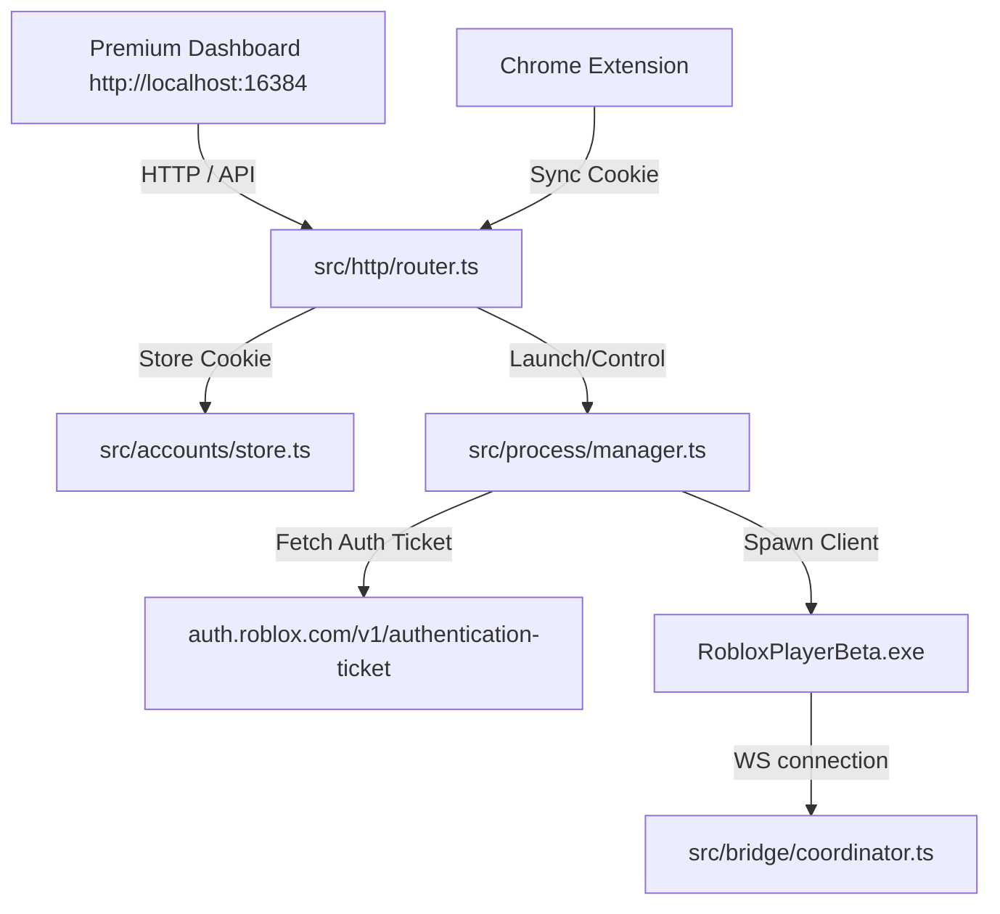

# Project State & Testing Roadmap

This file serves as a checkpoint of **thoughts, architecture design, and outstanding tasks** for any AI agent working on this codebase. 

---

## 🗺️ System Architecture

The project has been refactored into a **single unified MCP server** running on port `16384`.



- **Port `16384`**: Serves as the single unified port.
  - Handles the **Integrated Web Dashboard** (HTTP `/` and `/index.html`).
  - Handles all **Manager APIs** (`/api/accounts`, `/api/clients`, `/api/system-status`, etc.).
  - Handles the **WebSocket Bridge** for the in-game Luau execution script to connect.
- **Relay Mechanism**: If an instance of the server is already listening on `16384` (e.g., started by the IDE), any secondary instances started (e.g., via command line) automatically run in **Secondary Mode** and relay their actions to the Primary process to prevent port conflicts.

---

## ✅ Completed Milestones

1. **Integrated Web Dashboard**: Beautiful glassmorphic dark UI with live client list, system status, active stats counters, and profile cards showing usernames and Roblox avatars.
2. **Chrome Sync Extension**: Chrome extension under `chrome-extension/` that queries the `.ROBLOSECURITY` cookie from `roblox.com` and registers it directly with the backend.
3. **Cookie-Based Authenticated Launches**:
   - Decrypts the profile's `.ROBLOSECURITY` cookie.
   - Negotiates a fresh `rbx-authentication-ticket` token from Roblox's authentication endpoints (handles `X-CSRF-TOKEN` security headers and avoids `415 UnsupportedMediaType` errors by using explicit JSON content types).
   - Automatically queries the Windows registry to find registered custom custom bootstrappers (like **Fishstrap** or **Bloxstrap**) and executes them using the `roblox-player:` custom protocol.
   - Performs smart PID tracking: polls the process tree to capture the actual `RobloxPlayerBeta.exe` client process ID even when launched through a wrapper.
4. **Verified Multi-Instance Execution**: Verified that with Fishstrap's Multi-Instance toggle enabled, the manager can successfully spawn and track multiple authenticated accounts side-by-side (successfully tested with 3 concurrent profiles: `alt1`, `alt2`, `alt3`).

---

## 🧪 Current Testing Steps

Follow these steps to test the system:

### Step 1: Verification of Stored Accounts
Run the MCP tool `manage_accounts` with action `list` to check that the profile database has populated correctly:
```json
[
  {
    "alias": "alt1",
    "username": "yuyuryut",
    "userId": 11108136993,
    "avatarUrl": "https://..."
  }
]
```

### Step 2: Test Launching an Account
Call the `launch_client` tool with the account name:
```json
launch_client(account="alt1")
```
Alternatively, open the Dashboard at `http://localhost:16384/` and click the launch button.

*Expectation*: The Roblox client starts up and is logged into the `yuyuryut` account.

### Step 3: Test Executor Connection
Once the client is running:
1. Connect/inject the Luau executor into the Roblox client process.
2. Verify the client connects to `ws://localhost:16384`.
3. Try executing a simple test script (e.g. `execute(script="print('Hello from Agent')")`).

---

## 🔍 Troubleshooting & Operational Tips

- **Port 16384 Already in Use**: If the server fails to bind or says `Secondary`, there is likely an orphaned node process running from a prior execution. Kill it with:
  ```powershell
  taskkill /F /IM node.exe
  ```
- **IDE MCP Host**: Keep in mind that IDEs (Cursor/Windsurf) spawn their own instance of the MCP server as a Primary process. To reload code changes:
  1. Compile the TypeScript: `npm run build`
  2. Kill the running `node` process (the IDE will automatically reload it with the newly compiled code).
